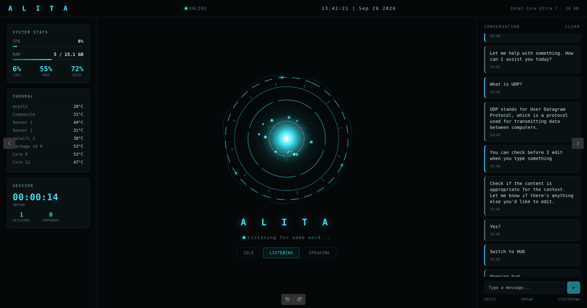

# Alita

A fully local, offline voice assistant that runs entirely on your own machine — no cloud, no API keys, no data leaving your laptop. You wake it up by saying its name, talk to it like a person, and it talks back.



The idea came from wanting to build something that was actually challenging enough to push my problem-solving, rather than just another project that looks good on paper. I’ve always been a big movie fan and Jarvis has been in my head for yeaars so building my own AI assistant felt like a pretty natural thing.
Of course, getting from the idea to something that actually works came with its share of headaches latency, edge cases, bugs that made absolutely no sense and a lot more time invested than I initially planned like turned to longer distance. But that’s also what made it interesting. It turned into a pretty deep rabbit hole, and seeing the whole thing come together and actually work is still satisfying.

## What it actually does

- Wakes up on a custom-trained wake word ("hey Alita"), not a generic keyword
- Understands natural spoken commands — not just fixed phrases, thanks to a local LLM (Ollama) doing the fuzzy matching on top of a fixed, safe command list
- Can hold an actual back-and-forth conversation, not just single commands
- Talks back with a real, natural-sounding voice (Kokoro TTS), not the robotic text-to-speech you're used to
- Has a sci-fi HUD that reacts live to what it's doing — idle, listening, speaking — with real system stats (CPU, RAM, temps) pulled straight from your machine
- Tracks your own app/window usage, browser history, and Steam playtime locally, and can answer questions about it
- Runs a fixed, pre-approved set of system commands (open apps, check things, control the system) — it can never execute arbitrary text as a command, on purpose
- Auto-starts on login and restarts itself if anything crashes

## Why local-only matters here

Everything runs on-device. Speech-to-text, the language model, the voice — all of it. Nothing gets sent anywhere. That was a deliberate choice from day one, not an afterthought: this assistant works completely offline, and there's no dependency on someone else's servers staying up, no usage limits, no privacy trade-off for convenience.

## The stack

| Piece | What it uses |
|---|---|
| Wake word | Custom-trained openWakeWord model |
| Speech-to-text | faster-whisper |
| Language understanding | Ollama (local LLM), qwen3:0.6b |
| Text-to-speech | Kokoro (ONNX) |
| HUD / interface | HTML + Canvas 2D, served through pywebview |
| Everything else | Python |

## Project structure

```
alita/
├── core/         # tracking, logging, rules, commands, security
├── voice/        # wake word, speech-to-text, text-to-speech
├── brain/        # Ollama integration
├── web/          # weather, site checks, recon tools
├── interface/    # the HUD
└── data/         # logs (not tracked in this repo)
```

## Getting it running

You'll need Python 3.12+, [Ollama](https://ollama.com) installed locally, and a few system packages for audio and the HUD window.

```bash
git clone https://github.com/<your-username>/alita.git
cd alita
python3 -m venv venv
source venv/bin/activate
pip install -r requirements.txt
```

Pull the model Alita uses for conversation:

```bash
ollama pull qwen3:0.6b
```

Copy the security template and set your own trigger phrases (this file is intentionally left out of the repo — see below):

```bash
cp core/security.py.example core/security.py
```

Then edit `core/security.py` and pick your own phrases before running anything.

Run it:

```bash
python3 core/wake.py
```

## A couple of things worth knowing

**`security.py` isn't in this repo, on purpose.** It holds the actual trigger phrases that pause the assistant, lock the screen, or wipe logs on this machine. Instead there's a `security.py.example` showing exactly how it's structured, so you can build your own version with your own phrases without me handing out mine.

**The command system is intentionally locked down.** Alita never runs raw typed or spoken text as a system command. Everything goes through a fixed, pre-approved list — the LLM helps match messy phrasing to that list, but it can't step outside it. This was a hard rule from the start, not something bolted on later.

**This is a learning project.** I built this to actually get good at programming logic and problem-solving, not just to have a working assistant. A lot of the interesting stuff in the commit history is debugging real, weird problems — Wayland not letting you query the focused window normally, wake-word models struggling with quiet speech, animation math that looked "stuttery" until the timing logic got fixed properly.

## Known limitations / still rough around the edges

- Some longer sessions can leave duplicate background processes running if the HUD isn't closed cleanly — a proper single-instance lock is on the to-do list
- The barge-in feature (interrupting Alita mid-sentence) works, but not 100% reliably yet
- Wake word detection is tuned for normal speaking volume, not whispering
- English only for now

---
Architecture, decisions, and all the debugging by me. Got some help from Claude for coding parts.

## License

MIT — do whatever you want with it just give me some credits guys.
